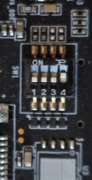
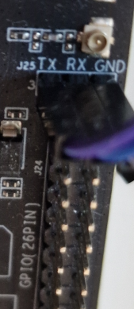

# Yocto support for Banana Pi F3  #

This document describes the initial Yocto support for the development board Banana Pi F3. 

The work was heavily based on the buildroot work done by Jesse Taube <Mr.Bossman075@gmail.com> and can be found [here](https://github.com/Mr-Bossman/bpi-f3-buildroot)

## Host Requirements ##

Depending on which Linux distribution you are running, you may need to manually install some host dependencies.

During creation of the bananapi-f3 layer, Ubuntu 23.10 was used without any host related issues after following [these instructions](https://docs.yoctoproject.org/5.0.4/ref-manual/system-requirements.html#ubuntu-and-debian)

See the [the list of supported Linux distributions](https://docs.yoctoproject.org/5.0.4/ref-manual/system-requirements.html#supported-linux-distributions)

It might also be a good idea to take a look at the [System Requirements](https://docs.yoctoproject.org/5.0.4/ref-manual/system-requirements.html#system-requirements).

## Prerequisites ##

Prepare the build by creating a project directory and fetch Poky from the Yocto project. The scarthgap release of Poky is used,

```shell
mkdir bpi-f3-yocto
cd bpi-f3-yocto
git clone git://git.yoctoproject.org/poky -b scarthgap
```

We also need to get the meta-riscv layers which our layer depends on:

```shell
git clone https://github.com/riscv/meta-riscv.git -b scarthgap
```

## Project setup and configuration ##

The first thing we need to do is to clone the layer.

```shell
git clone https://github.com/qamcom/Banana-Pi-F3-for-Yocto.git meta-bananapi-f3
```

Next, we initialize a build directory:

```shell
source poky/oe-init-build-env build
```

This places you in the build directory with some pre populated files.

Two files are of interest to us:
  * `conf/bblayers.conf`
  * `conf/local.conf`

Add the following lines to the `BBLAYERS` variable in `conf/bblayers.conf`:
```
  /path/to/bpi-f3-yocto/meta-riscv \
  /path/to/bpi-f3-yocto/meta-bananapi-f3 \
```

Next, change the `MACHINE` variable in `conf/local.conf`.

Find the line where the default `MACHINE` is set to `qemux86-64` (should be at line 39), and change it to this:

```shell
MACHINE ??= "bananapi-f3"
```

## Build and prepare SD card ##

All that's left to do now, is to start the build. This will take quite a while. On a Ryzen 7 16 cores 2.7GHz, 32GB RAM, NVMe disk, this took ~40 minutes but can take much longer of course.

```shell
bitbake bananapi-f3-image
```

When the build has finished successfully, there will be an image file in <build>/tmp/deploy/images/bananapi-f3/ named sdcard.img.

This image file can be written to an SD card with dd, like so:

```shell
sudo dd status=progress oflag=sync bs=1M if=tmp/deploy/images/bananapi-f3/sdcard.img of=/dev/sd<X> ; sync
```

**WARNING** Please make sure you write the image to the correct device (/dev/sd<X>)!

## Setup the board ##

First, make sure the board is configured to boot from the SD card by making sure the DIP switches are set correctly. All switches except switch 4 should be OFF. (See image below)



Next, connect a serial-to-USB dongle to the UART pins next to the GPIO pins (see image below).



Start your favorite terminal program and connect to the UART device.

And don't forget to insert the SD card into the SD card slot too.

Now you're ready to power on the board.

## Limitations ##

  * Realtek wireless drivers are not built
  * Proprietary files needed in the rootfs to enable remoteproc control of the other core

## Future improvements ##

  * Use wic instead of genimage to create sdcard.img
  * Fix build warnings
  * Update U-Boot recipe to eliminate the board/spacemit/k1 config.mk patch related to out-of-source builds
